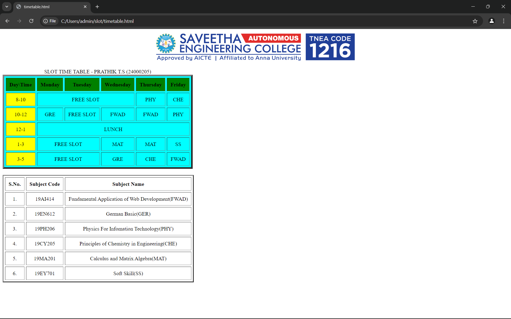

# Ex03 Time Table
## Date:

## AIM
To write a html webpage page to display your slot timetable.

## ALGORITHM
### STEP 1
Create a Django-admin Interface.

### STEP 2
Create a static folder and inert HTML code.

### STEP 3
Create a simple table using ```<table>``` tag in html.

### STEP 4
Add header row using ```<th>``` tag.

### STEP 5
Add your timetable using ```<td>``` tag.

### STEP 6
Execute the program using runserver command.

## PROGRAM
```
<!DOCTYPE html>
<html>
    <head>
        <style>
            td
            {
                text-align: center;
            }
        </style>
    </head>
    <body>
        
        <table border="5" cellspacing="5" cellpadding="10" bgcolor="violet">
            <br>
            <br>
            <caption align="top">SLOT TIME TABLE - PRATHIK T.S (24000205)</caption>
            <tr>
                <th bgcolor="green">Day\Time</th>
                <th bgcolor="green">Monday</th>
                <th bgcolor="green">Tuesday</th>
                <th bgcolor="green">Wednesday</th>
                <th bgcolor="green">Thursday</th>
                <th bgcolor="green">Friday</th>  
            </tr>
            <tr>
                <td bgcolor="yellow">8-10</td>
                <td colspan="3">FREE SLOT</td>
                <td>PHY</td>
                <td>CHE</td>
            </tr>
            <tr>
                <td bgcolor="yellow">10-12</td>
                <td>GRE</td>
                <td>FREE SLOT</td>
                <td>FWAD</td>
                <td>FWAD</td>
                <td>PHY</td>
            </tr>
            <tr>
                <td bgcolor="yellow">12-1</td>
                <td colspan="5">LUNCH</td>
            </tr>
            <tr>
                <td bgcolor="yellow">1-3</td>
                <td colspan="2">FREE SLOT</td>
                <td>MAT</td>
                <td>MAT</td>
                <td>SS</td>
            </tr>
            <tr>
                <td bgcolor="yellow">3-5</td>
                <td colspan="2">FREE SLOT</td>
                <td>GRE</td>
                <td>CHE</td>
                <td>FWAD</td>
            </tr>
        </table>
        <br>
        <table border="3" cellspacing="5" cellpadding="10">
            <tr>
                <th>S.No.</th>
                <th>Subject Code</th>
                <th>Subject Name</th>
            </tr>
            <tr>
                <td>1.</td>
                <td>19AI414</td>
                <td>Fundamental Application of Web Development(FWAD)</td>
            </tr>
            <tr>
                <td>2.</td>
                <td>19EN612</td>
                <td>German Basic(GER)</td>
            </tr>
            <tr>
                <td>3.</td>
                <td>19PH206</td>
                <td>Physics For Infomation Technology(PHY)</td>
            </tr>
            <tr>
                <td>4.</td>
                <td>19CY205</td>
                <td>Principles of Chemistry in Engineering(CHE)</td>
            </tr>
            <tr>
                <td>5.</td>
                <td>19MA201</td>
                <td>Calculus and Matrix Algebra(MAT)</td>
            </tr>
            <tr>
                <td>6.</td>
                <td>19EY701</td>
                <td>Soft Skill(SS)</td>
            </tr>
        </table>
    </body>
</html>
```
## OUTPUT


## RESULT
The program for creating slot timetable using basic HTML tags is executed successfully.
